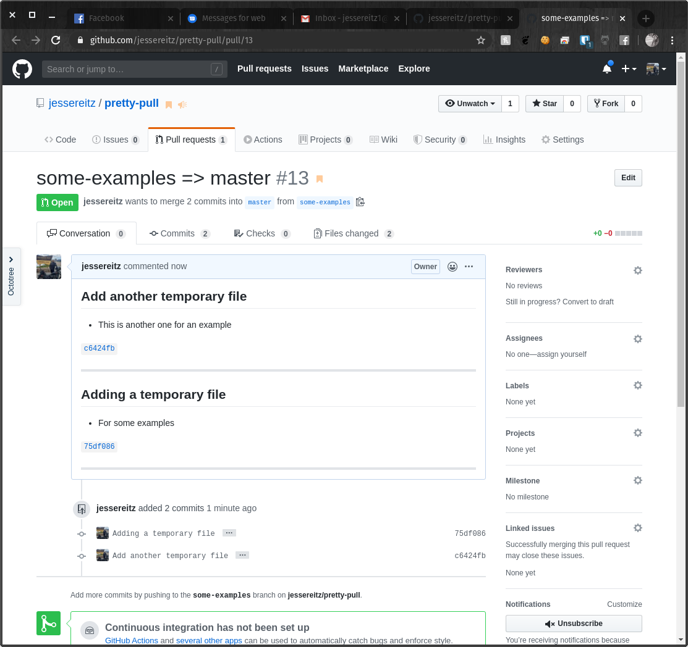

# pretty-pull
Open a pull request, fill it with commit messages

## Usage
pretty-pull makes use of GitHub's [`hub` utility](https://hub.github.com/) to open pull requests. Please install it before trying to use pretty-pull.

1. Source or copy `pretty-pull` in your `.bashrc` or `.bash_profile`
2. `$ pretty-pull <BASE_BRANCH> <FEATURE_BRANCH>`
    1. `BASE_BRANCH` is optional and will default to `master`
    2. `FEATURE_BRANCH` is optional and will default to the currently-checked-out branch

```bash
hub clone jessereitz/pretty-pull &&
echo ". ~/pretty-pull/pretty-pull" >> ~/.bashrc
```

## Example
The following git commits:
```
commit c6424fb025bc56207ba590488e87aabc433d211d (HEAD -> some-examples, origin/some-examples)
Author: Jesse Reitz <jessereitz1@gmail.com>
Date:   Fri Apr 24 14:14:59 2020 -0500

    Add another temporary file

    * This is another one for an example

commit 75df086107a146a0ffe1e9d2cdab357b1e423940
Author: Jesse Reitz <jessereitz1@gmail.com>
Date:   Fri Apr 24 14:14:19 2020 -0500

    Adding a temporary file

    * For some examples
```

Turn into a PR like this:

